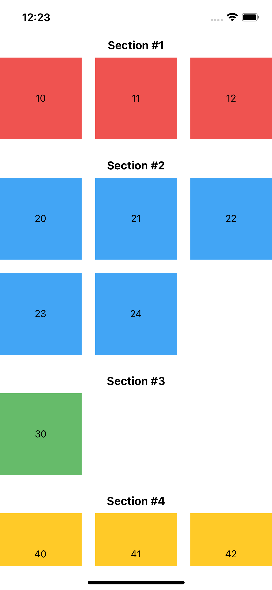

# rn-section-grid-list

This package for React Native provides SectionGridList component which works the same as usual SectionList but also adds the ability to render columns in sections by providing numColumns parameter (as in FlatList).

<!--  -->


## Installation

```sh
npm install rn-section-grid-list
```

## Usage

```js
import { SectionGridList } from 'rn-section-grid-list';

// ...

const sections = useMemo(
  () => [
    { data: ['00', '11', '22'], key: 'Section #1' },
    { data: ['33', '44', '55', '66', '77'], key: 'Section #2' },
    { data: ['88'], key: 'Section #3' },
  ],
  []
);

// ...

<SectionGridList
  RowSeparatorComponent={<View style={styles.rowSeparator} />}
  renderSectionHeader={({ section }) => (
    <Text style={styles.sectionHeaderText}>{section.key}</Text>
  )}
  numColumns={3}
  renderItem={({ item }) => (
    <View style={styles.item}>
      <Text>{item}</Text>
    </View>
  )}
  sections={sections}
/>;

// ...

const styles = StyleSheet.create({
  item: {
    alignItems: 'center',
    backgroundColor: 'pink',
    height: Dimensions.get('window').width * 0.3,
    justifyContent: 'center',
    minWidth: '30%',
  },
  rowSeparator: {
    height: Dimensions.get('window').width * 0.05,
  },
  sectionHeaderText: {
    fontSize: 16,
    fontWeight: 'bold',
    marginVertical: 8,
    textAlign: 'center',
  },
});
```

## Contributing

See the [contributing guide](CONTRIBUTING.md) to learn how to contribute to the repository and the development workflow.

## License

MIT

---

Made with [create-react-native-library](https://github.com/callstack/react-native-builder-bob)
